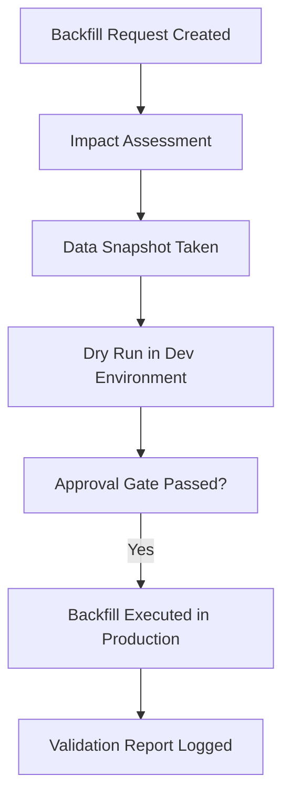

# Data Versioning and Backfills – RideShareApp Platform

## Objective
Establish a standardized approach for managing data versioning and executing safe, traceable backfills across the RideShareApp Platform, enabling reproducible ML pipelines, governed transformations, and consistent data consumption.

---

## 1. Why Versioning Matters
- **Model Reproducibility**: Ensure ETA, surge pricing, and fraud models use consistent training data
- **Regulatory Readiness**: Maintain lineage and auditability for fare calculations, driver incentives
- **Collaboration**: Enable data scientists and analytics teams to test changes without overwriting shared datasets

---

## 2. Data Versioning Strategy
| Data Type         | Versioning Technique                                   | Tooling                      |
|-------------------|--------------------------------------------------------|------------------------------|
| Raw Ingest        | Partitioned by ingestion date + batch ID              | BigQuery, GCS               |
| Feature Pipelines | Hash-based versioning of transformation config        | Feast, Airflow, MLflow      |
| ML Datasets       | Immutable snapshots linked to `model_run_id`          | DVC, MLflow, Vertex AI      |
| Events            | Schema versioned Avro with backward compatibility     | Kafka + Schema Registry     |
| Dashboard Tables  | Staged views (`v1`, `v2`, ...) with timestamp columns | Looker, dbt                 |

---

## 3. Backfill Principles
- **Idempotency**: All jobs must support multiple safe re-runs without duplication
- **Selective Rerun**: Use `where` clauses or partition filters to scope affected records
- **Metadata Tracking**: Log backfill `job_id`, `operator`, `dataset`, `affected_range` to audit store
- **Dry Run Mode**: CI/CD jobs must support `--dry-run` flag for previewing impact
- **Data Lineage Tags**: Output tables must tag source inputs for transparency

---

## 4. Backfill Workflow

---

## 5. Governance and Review
- Backfills for critical tables (pricing, trip status, earnings) require:
  - Architecture Data Steward approval
  - Data Quality dashboard update
  - Git PR with config/version hash
- Monthly review of backfills to analyze patterns and prevent repeated root causes

---

## 6. Tooling Ecosystem
- **Airflow**: Orchestrates backfill DAGs with audit tagging
- **Feast**: Tracks historical feature versions across model training sessions
- **MLflow**: Links dataset hashes to model metadata and deployment artifacts
- **Great Expectations**: Used to validate data quality before and after backfill
- **dbt**: Used for versioned transformations of dimensional models

---

## Summary
By institutionalizing data versioning and backfill workflows, the RideShareApp Platform ensures traceability, model consistency, and operational rigor across its real-time and batch pipelines. These patterns are essential for scaling trust in data-driven decision-making and ML outcomes.
