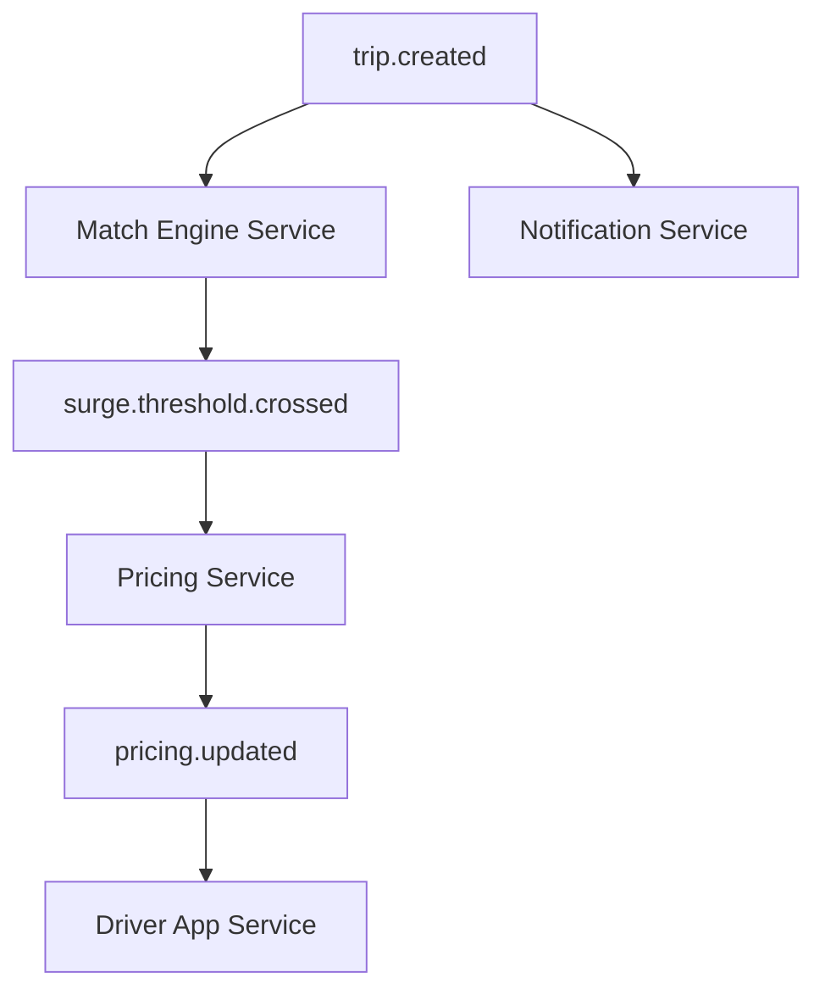

# Event-Driven Architecture (EDA) – RideShareApp Platform

## Objective
Establish a robust, scalable, and observable Event-Driven Architecture (EDA) framework across the RideShareApp Platform that supports loosely coupled services, improves system resiliency, and accelerates real-time responsiveness across trip lifecycle operations.

---

## 1. Motivation
- **Decoupling Systems**: Isolate microservices like Booking, Pricing, Trip Events, and Notifications
- **Scalability**: Enable asynchronous processing for high-volume workflows like surge pricing, trip state updates
- **Flexibility**: Allow services to evolve independently via schema versioning and topic branching
- **Observability**: Improve auditability and flow tracing across distributed workflows

---

## 2. Key Event Domains
| Domain             | Example Events                                              |
|--------------------|-------------------------------------------------------------|
| Trip Lifecycle     | `trip.created`, `trip.accepted`, `trip.cancelled`, `trip.completed` |
| Pricing & Surge    | `pricing.updated`, `surge.threshold.crossed`               |
| Driver Management  | `driver.shift.started`, `driver.location.updated`          |
| Rider Engagement   | `rider.app.opened`, `rider.feedback.submitted`             |
| Payments & Rewards | `payment.failed`, `payment.retried`, `coupon.applied`     |

---

## 3. Platform Design Guidelines
- **Event Format**: CloudEvents v1.0 (JSON), with `id`, `source`, `type`, `time`, `data` fields
- **Event Versioning**: Backward-compatible schemas using Avro with schema registry version pinning
- **Durable Delivery**: Events published to Kafka with a 7-day retention and DLQ fallback
- **Consumer Responsibility**: Consumers must implement idempotency and handle out-of-order events
- **Topic Ownership**: Each event topic must have a designated owning squad and documentation

---

## 4. EDA Infrastructure
- **Broker**: Kafka (multi-tenant clusters across regions)
- **Registry**: Confluent Schema Registry (or GCP Schema Service)
- **Routing**: Kafka Connect + Kafka Streams + Stream Filtering Lambdas
- **Replayability**: Consumers can rehydrate projections using time-bound topic rewind
- **Monitoring**: Lag monitors, dead-letter queue dashboards, event flow observability in Grafana

---

## 5. Event Flow Pattern – Example

---

## 6. Anti-Patterns to Avoid
- **Synchronous Event Handlers**: Never block HTTP threads on event publish ACKs
- **Overloading Event Semantics**: One event should represent one domain-specific state change
- **Inconsistent Naming**: Maintain uniform verb-noun naming like `trip.cancelled`, not `cancel.trip`
- **No DLQ Handling**: Must include retry or quarantine patterns for poison messages

---

## 7. Governance and Change Management
- Event schemas must pass CI validation via pre-commit hooks
- Breaking changes must undergo ADR review and notify downstream consumers
- Audit logs must be retained for all critical event topic publications
- Runbook links should be embedded in event consumer alert dashboards

---

## Summary
EDA enables the RideShareApp Platform to operate with resilience, modularity, and near real-time responsiveness. From driver shift changes to trip completions, events carry the pulse of platform activity and unlock innovation through decoupled domain evolution.
