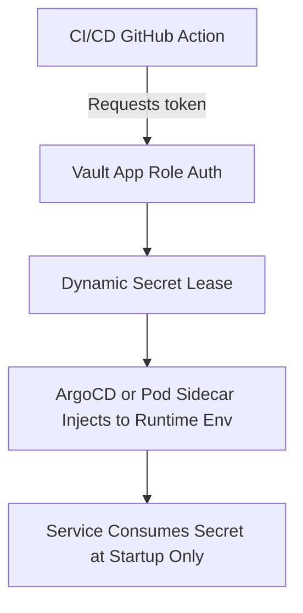

# Secrets Management – RideShareApp Platform

## Objective
Define a secure, automated, and policy-enforced approach for secrets management across the RideShareApp Platform. This ensures that credentials, API keys, tokens, and other sensitive assets are stored, rotated, and accessed safely throughout the SDLC.

---

## 1. Guiding Principles
- **No Secrets in Git**: All secrets must be externalized and never hardcoded in source code or manifests.
- **Runtime Injection Only**: Secrets are pulled dynamically at runtime using identity-based authorization.
- **Automated Rotation**: Secrets have rotation policies aligned with environment tier and data sensitivity.
- **Audit and Traceability**: All secret access is logged with identity, purpose, and usage timestamp.

---

## 2. Vault-Based Management Architecture
- **Tool**: HashiCorp Vault (Cloud-hosted)
- **Authentication Methods**:
  - Kubernetes service account tokens (GKE workload identity)
  - GitHub App Auth for CI/CD pipelines
- **Mount Points**:
  - `/rideshareapp/prod/payment-gateway/stripe-key`
  - `/rideshareapp/staging/ml-featurestore-readonly`
- **Policy Enforcement**:
  - Policies are created per microservice (`trip-matcher`, `pricing-engine`, etc.)
  - Secrets are scoped with TTL and usage limits

---

## 3. Secrets Delivery Flow

---

## 4. Rotation and Lifecycle Policies
| Secret Type          | Rotation Frequency | Rotation Method                    |
|----------------------|--------------------|------------------------------------|
| DB Credentials       | Every 14 days      | Vault dynamic credentials          |
| API Keys (e.g. KYC)  | Monthly            | Reissued via secure partner portal |
| TLS Certs            | Every 90 days      | Automated via cert-manager         |
| JWT Signing Secrets  | Annually           | Manual key ceremony with vault log |

---

## 5. CI/CD Integration
- GitHub Actions fetch short-lived tokens using Vault GitHub auth
- All Helm charts use placeholders and are templated via `values.secrets.<key>`
- ArgoCD sync includes vault-agent sidecar injector annotations
- Secrets must pass automated scan checks via GitGuardian and truffleHog pre-merge

---

## 6. Governance and Compliance
- Access reviews are conducted monthly for all Vault paths
- Vault audit logs are streamed to BigQuery and filtered by path, user, and service
- Any secrets leakage incident triggers a red team simulation and policy update
- Secrets-related ADRs must be reviewed by Platform Security Council

---

## Summary
Secrets management on the RideShareApp Platform is designed to be invisible, traceable, and tamper-resistant. Vault-backed secrets injection, rotation discipline, and environment-specific scopes ensure sensitive information is protected at every level—from CI to production workloads.
