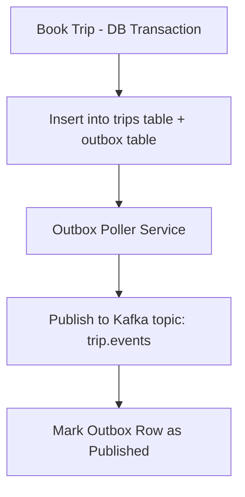

# Transactional Outbox Pattern – RideShareApp Platform

## Objective
Implement the **Transactional Outbox Pattern** across the RideShareApp Platform to ensure reliable message publication and eventual consistency between the application database and event streaming systems like Kafka, especially in transactional workflows like trip booking, driver onboarding, and fare reconciliation.

---

## 1. Problem Statement
Traditional event emission directly after DB commits can lead to inconsistencies during service crashes or broker failures. In RideShareApp, this could result in:
- Booked trips not emitting `TripCreated` events
- Incentives granted but no downstream projections updated
- Driver approvals without onboarding confirmation downstream

---

## 2. Pattern Design Overview
### Core Idea:
Write outbound events to an "outbox" table within the same transactional boundary as the business operation. A separate outbox poller reads these entries and reliably publishes them to Kafka.



---

## 3. Use Cases in RideShareApp
| Domain              | Trigger Action                  | Outbox Event Example                |
|---------------------|----------------------------------|-------------------------------------|
| Trip Booking        | `trip.booked`                   | `TripCreated`                       |
| Rider KYC           | `verification.complete`         | `UserVerified`                      |
| Incentive Engine    | `incentive.granted`             | `IncentiveGranted`                  |
| Fraud Decisioning   | `fraud.alert`                   | `FraudCaseEscalated`                |
| Fare Reconciliation | `trip.completed`                | `FareSettled`                       |

---

## 4. Outbox Table Schema (Example)
```sql
CREATE TABLE trip_outbox (
  id UUID PRIMARY KEY,
  aggregate_type VARCHAR,
  aggregate_id VARCHAR,
  event_type VARCHAR,
  payload JSONB,
  status VARCHAR DEFAULT 'PENDING',
  created_at TIMESTAMP,
  published_at TIMESTAMP
);
```

---

## 5. Polling Service Architecture
- **Implementation**: Golang/Node.js poller service deployed as sidecar or shared DaemonSet
- **Delivery**:
  - Deduplicated using `idempotent key`
  - Publishes to Kafka via retry queue with DLQ fallback
- **Backpressure Handling**:
  - Rate limiting per domain
  - Batch publishing with checkpoint

---

## 6. Operational Concerns
- **Monitoring**:
  - Outbox lag alerts via Prometheus + Grafana
  - Kafka publish errors routed to PagerDuty
- **Idempotency**:
  - Downstream consumers must support idempotent event handling
- **Audit Trail**:
  - Outbox records retained for 7 days for audit replay
- **Circuit Breaker**:
  - Pause outbox draining on schema mismatch or topic errors

---

## 7. Governance
- All teams must use platform-provided `outbox-client-lib`
- Schema validations enforced via `schema-registry-check` in CI
- Topics must follow naming convention: `<domain>.<event>.v<version>`
- Publishing logic must not be embedded in business services

---

## Summary
The Transactional Outbox Pattern is mission-critical for the RideShareApp Platform’s event-driven reliability. It ensures atomicity between writes and event dispatch, improves observability of failure cases, and decouples core services from fragile delivery guarantees.
