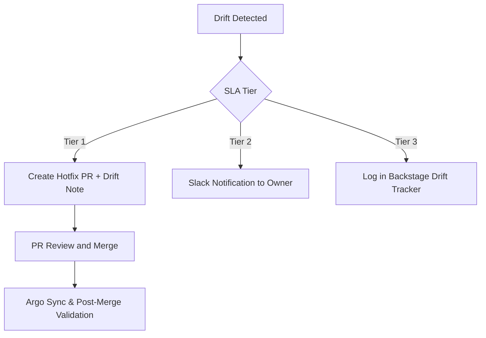

# Configuration and Drift Detection – RideShareApp Platform

## Objective
Define robust practices and automation to detect, prevent, and respond to configuration drift across the RideShareApp Platform, ensuring infrastructure, app services, and ML environments remain consistent, secure, and observable.

---

## 1. Scope of Configuration Drift
| Domain             | Examples of Drift                                                             |
|--------------------|------------------------------------------------------------------------------|
| Infra (IaC)        | Manual GCP IAM role edits outside Terraform state                            |
| App Services       | Feature flags toggled manually in staging but not in prod                    |
| CI/CD Pipelines    | Deployment env vars updated via UI but not committed to repo                 |
| ML Pipelines       | Hyperparameters or datasets updated in notebook, not versioned               |
| Notification System| Kafka topic retention policy changed outside repo-committed configuration    |

---

## 2. Detection Framework
- **Infrastructure-as-Code Diff**: Terraform Plan Audit via CI, Driftctl or OpenTofu with auto-alerts
- **Runtime Drift Monitor**: Periodic scanning of GKE cluster config vs declared Helm values
- **CI/CD Observability**: Compare GitHub Actions and ArgoCD manifests against running workloads
- **ML Metadata Registry**: Track feature store schema and model input/output consistency over time

---

## 3. Platform Policies
- **Drift Alerts as PagerDuty Events** for Tier-1 domains (e.g., Booking, Matching, Pricing)
- **Block Merge** if detected Terraform drift not reconciled within SLA
- **All Flags as Code**: LaunchDarkly or internal feature flag changes must be Git-backed
- **Immutable Environments**: No shell access to prod pods unless through break-glass with audit trail

---

## 4. Tooling Stack
| Tool              | Purpose                                                  |
|-------------------|----------------------------------------------------------|
| Driftctl/OpenTofu | Detect infra drift from Terraform                        |
| ArgoCD SyncStatus | Ensure declared Helm/app state matches actual cluster    |
| ConfTest          | Validate config integrity via policy rules               |
| MLflow + Feast    | Validate feature store schemas and training consistency  |
| GitHub Action     | Run config diff validators during PR and post-merge CI   |

---

## 5. Resolution Workflow

---

## 6. Governance
- **Platform Infra Reviews**: Bi-weekly drift summary presented to SRE and Security Leads
- **Drift Dashboard**: Backstage plugin showing frequency, surface area, and owners
- **Postmortem Injection**: Any drift-related outage or incident must be captured in RCA

---

## Summary
Configuration drift is a silent platform killer—breaking consistency, compliance, and confidence. The RideShareApp Platform mitigates this risk with automated scanning, Git-backed declarative policies, and resolution workflows that are observable, repeatable, and auditable.
